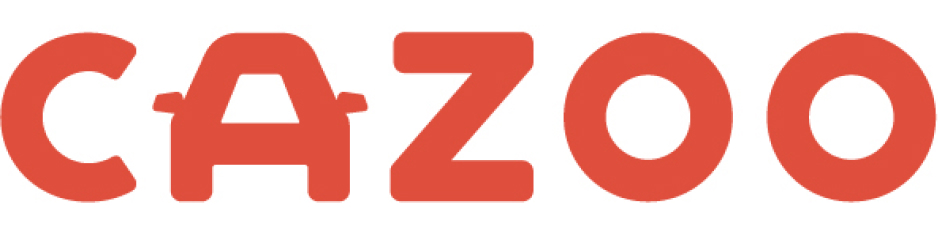

<h1> Hello World</h1>

- 👋 Hi, I’m Przemek and I like computer stuff 💻
- 🌐 Web focused Senior Software Engineer based in 💂‍♂️ London, UK 🇬🇧
- 🚀 Currently making our internal tech more amazing at [Beauty Pie](https://www.beautypie.com/) 💅

👨‍💻 Previously helped with building:

-  💉
-  🚗
-  🔍

<!--
**padamczewski/padamczewski** is a ✨ _special_ ✨ repository because its `README.md` (this file) appears on your GitHub profile.

Here are some ideas to get you started:

- 🔭 I’m currently working on ...
- 🌱 I’m currently learning ...
- 👯 I’m looking to collaborate on ...
- 🤔 I’m looking for help with ...
- 💬 Ask me about ...
- 📫 How to reach me: ...
- 😄 Pronouns: ...
- ⚡ Fun fact: ...
-->

